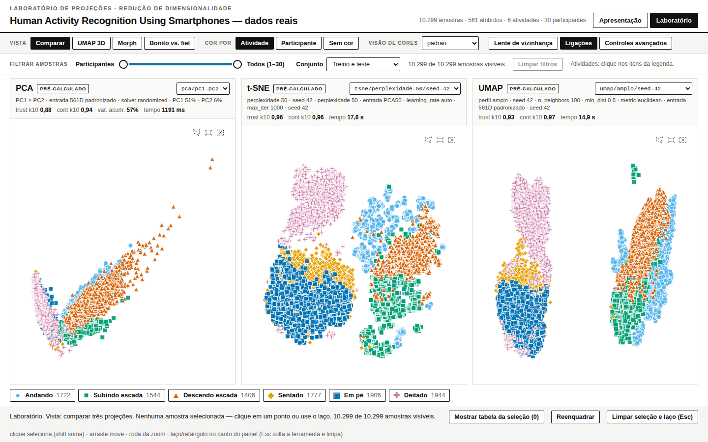
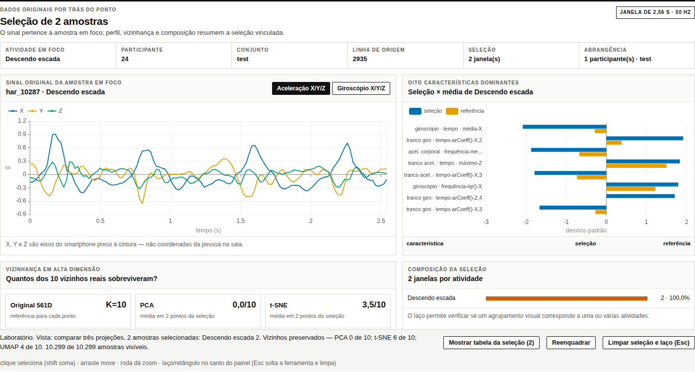
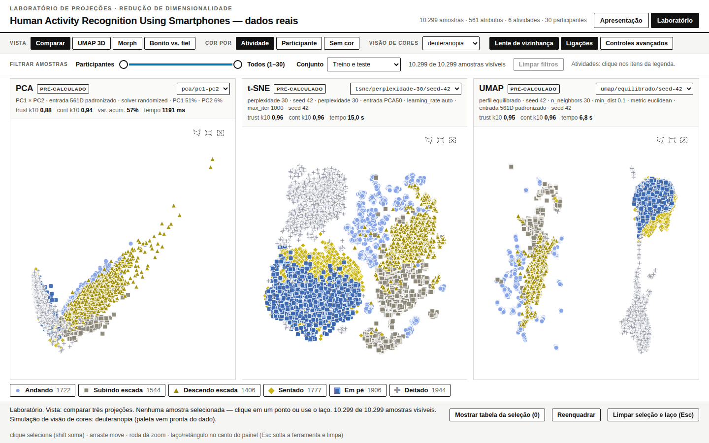
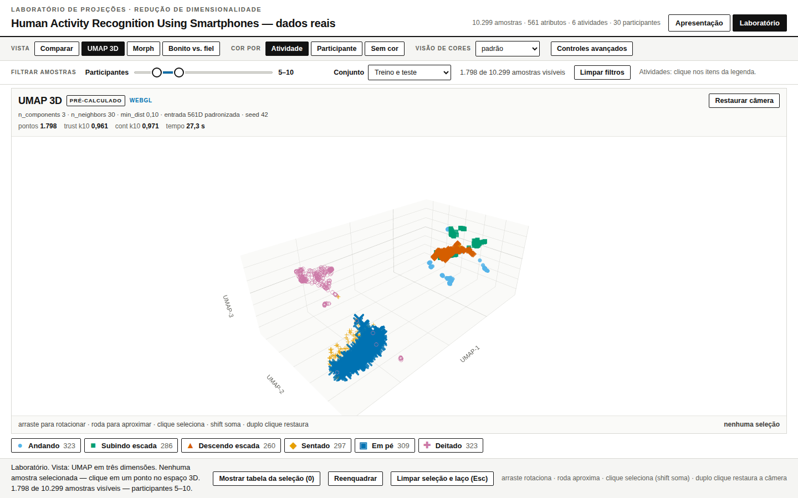

# Laboratório de Projeções — HAR real

Laboratório interativo de redução de dimensionalidade (PCA, t-SNE e UMAP)
construído sobre o dataset Human Activity Recognition Using Smartphones, da
UCI. Um único HTML offline compara as três projeções lado a lado sobre as
mesmas 10.299 amostras, com seleção vinculada entre painéis, simulação de
daltonismo e um modo experimental que projeta gravações de movimento
capturadas ao vivo por um iPhone.

Feito para o seminário de Visualização Computacional: a ideia central é
tornar redução de dimensionalidade observável e discutível, sem esconder
parâmetros, incerteza nem a diferença entre dado medido, transformação
matemática e ilustração.

## Capturas de tela

| Modo laboratório | Inspetor da amostra |
|---|---|
|  |  |

| Simulação de deuteranopia | UMAP 3D |
|---|---|
|  |  |

## Destaques

- Três técnicas de redução — PCA, t-SNE (três perplexidades) e UMAP (três
  perfis de vizinhança, mais uma versão 3D) — sobre o mesmo conjunto de
  10.299 amostras e 561 atributos, com IDs estáveis entre painéis.
- Seleção vinculada: clicar ou laçar um ponto destaca a mesma amostra nas
  três projeções, com vizinhos preservados, métricas e um inspetor com o
  sinal inercial triaxial original da janela.
- Filtros sincronizados por participante (slider duplo), conjunto de
  treino/teste e atividade — todos os painéis, contagens e legendas
  respeitam o mesmo subconjunto.
- Paleta classe→cor otimizada por distância perceptual sob simulação de
  protanopia, deuteranopia e tritanopia, com forma redundante além de cor.
- Entrega em HTML único, sem dependência de rede — dados comprimidos e
  descompactados sob demanda no navegador.
- Spike "Participante 31": captura de movimento pelo Safari do iPhone sem
  aplicativo nativo, relay por WebSocket, reajuste de PCA/UMAP num espaço de
  características comum entre HAR e iPhone, e t-SNE aproximado e rotulado
  como tal.

## Estrutura

- `src/build_har_data.py`: carrega o ZIP UCI, calcula projeções e gera dados.
- `src/prepare_prototype.py`: preserva e adapta o protótipo GAP.
- `src/add_inspector.py`: adiciona o inspetor contextual ao protótipo.
- `src/bundle_html.py`: cria um HTML único sem dependências de rede.
- `src/live_server.py`, `src/live_features.py`, `src/live_projection.py`:
  relay, extração de características e reprojeção do modo ao vivo.
- `web/index.html`: versão de desenvolvimento com scripts locais.
- `web/har-data.js`: dados reais gerados pelo pipeline.
- `dist/laboratorio-har-real.html`: entrega autocontida.
- `live/`: páginas do modo ao vivo (captura no iPhone e dashboard).
- `results/metrics.json`: métricas e metadados de reprodutibilidade.
- `ANALISE-PARA-APRESENTACAO.md`: achados quantitativos, interpretação e fala
  pronta sobre atividades estáticas/dinâmicas, PCA, t-SNE e UMAP.
- `tests/`: suíte com smoke test de interface, rotas do relay e projeção.

## Protocolo

- Entrada comum: `StandardScaler` sobre os 561 atributos.
- PCA: 50 componentes; PC1 e PC2 alimentam o painel 2D.
- t-SNE: entrada PCA50, perplexidades 10, 30 e 50, seed 42.
- UMAP: perfis local `(10, 0.05)`, equilibrado `(30, 0.10)` e amplo
  `(100, 0.50)`, seed 42.
- UMAP 3D: perfil equilibrado `(30, 0.10)`, métrica euclidiana, inicialização
  espectral e seed 42; as três coordenadas são pré-calculadas em Python.
- Vizinhos originais: aproximação NNDescent nos 561 atributos padronizados.
- Inspetor: seis sinais inerciais com 128 leituras por janela e matriz
  10.299 × 561 quantizada; ambos são comprimidos no próprio HTML e abertos
  localmente somente após a primeira seleção.
- Métricas: trustworthiness, continuity, overlap k-NN, Spearman de
  distâncias e silhouette secundária, calculadas em subamostra estratificada
  fixa.
- Rótulos não entram no ajuste das projeções; são usados somente para cor,
  símbolos, acessibilidade e métricas secundárias.

## Como rodar

```bash
python3 -m venv --system-site-packages .venv
PIP_CACHE_DIR=.cache/pip .venv/bin/pip install -r requirements.txt

.venv/bin/python src/prepare_prototype.py
.venv/bin/python src/build_har_data.py
.venv/bin/python src/bundle_html.py
```

Para abrir a versão de desenvolvimento:

```bash
python3 -m http.server 8000 --directory web
```

Depois acesse `http://localhost:8000`. A entrega em `dist/` abre direto no
navegador, sem servidor nem internet.

Na aba UMAP 3D, arraste para rotacionar, use a roda para zoom e clique em um
ponto para vinculá-lo aos painéis PCA, t-SNE e UMAP 2D. A câmera é
preservada ao trocar filtros e pode ser restaurada pelo botão da própria
aba. No modo laboratório, clique em um ponto e, só se quiser sair da
demonstração dos métodos, pressione "abrir detalhes da amostra".

## Observação científica

As distâncias, áreas e densidades aparentes de t-SNE e UMAP não são medidas
diretas da geometria original. A interface compara preservação de
vizinhanças e parâmetros; ela não declara um vencedor universal.

## Modo ao vivo — Participante 31

O diretório `live/` traz uma primeira superfície móvel para o Safari e um
monitor de transmissão para o notebook. `src/live_server.py` serve as duas
páginas e retransmite lotes de sensores por WebSocket. O motivo de cada
decisão de design está detalhado em [`LIVE-IPHONE-SPEC.md`](LIVE-IPHONE-SPEC.md);
aqui vai o passo a passo pra rodar.

Instale as dependências do modo ao vivo e inicie o servidor local:

```bash
.venv/bin/pip install -r requirements-live.txt
.venv/bin/python src/live_server.py --host 127.0.0.1 --port 8765
```

Abra no notebook:

```text
http://127.0.0.1:8765/dashboard?session=P31&token=TOKEN_GERADO
```

O servidor imprime as URLs completas e gera um token de pareamento
aleatório a cada início. Não remova esse token nem publique a URL completa.

No próprio notebook, `http://127.0.0.1` é aceito como contexto local
confiável. No iPhone, porém, `localhost` apontaria para o próprio telefone,
e o IP comum da rede local não é um contexto seguro — a página acessada
pelo iPhone precisa chegar por HTTPS.

### HTTPS privado com Tailscale Serve

O fluxo validado usa `tailscale serve`, restrito à tailnet. Ele fornece
certificado `ts.net` válido e encaminha WSS sem publicar o relay na
internet. O iPhone precisa estar conectado à mesma tailnet com o app
Tailscale ativo.

Uma vez por máquina, se o comando exigir root, autorize o usuário local
como operador:

```bash
sudo tailscale set --operator="$USER"
```

Com relay e laboratório escutando só em loopback, publique-os em portas
HTTPS distintas:

```bash
tailscale serve --bg --https=443 http://127.0.0.1:8765
tailscale serve --bg --https=8443 http://127.0.0.1:8000
tailscale serve status
```

As URLs ficam no formato:

```text
https://HOST-FORNECIDO/mobile?session=P31&token=TOKEN_GERADO
https://HOST-FORNECIDO/dashboard?session=P31&token=TOKEN_GERADO
https://HOST-FORNECIDO:8443/
```

Use exatamente a mesma `session` e o mesmo `token` na URL do dashboard. O
token é uma credencial temporária e não deve ser publicada. Abra a URL
móvel direto no Safari, toque em permitir sensores, calibre o aparelho
parado e só então grave. O parâmetro `&demo=1` simula sinais pra
desenvolvimento sem telefone, mas nunca deve ser usado em resultados.

Pra retirar as duas publicações privadas:

```bash
tailscale serve --https=443 off
tailscale serve --https=8443 off
```

`tailscale funnel` não faz parte do fluxo validado — só entra em cena se o
iPhone não puder entrar na tailnet, já que torna o serviço acessível pela
internet pública e exige uma avaliação de risco separada.

### Pacote portátil pro notebook

O pacote `har-live` reúne páginas, relay, laboratório, wheels pra Python
3.10–3.13 e scripts de início/parada. Enquanto a entrega privada estiver
ativa, uma máquina conectada à tailnet pode instalar pelo endereço
`https://SEU-HOST.ts.net/entrega/`. Prefira baixar e inspecionar o
instalador antes de rodar:

```bash
curl -fsSLO https://SEU-HOST.ts.net/entrega/instalar.sh
less instalar.sh
bash instalar.sh
```

Depois da instalação em `~/har-live`:

```bash
~/har-live/start-har-live.sh
cat ~/har-live/.run/urls.txt
~/har-live/stop-har-live.sh
```

O arquivo de URLs e o token são recriados a cada início com permissão
`0600` e removidos na parada.

O relay aceita só tipos de mensagem conhecidos, limita lote e tamanho de
frame, valida números e faixas, mantém o dashboard somente leitura e envia
headers contra cache, iframe e carregamento de scripts externos. Ainda
assim, encerre o modo ao vivo após a demonstração e reinicie-o pra
invalidar o token usado.

O espaço "HAR live" reajusta um pipeline de 128 características comuns,
extraídas igualmente dos sinais oficiais do HAR e das gravações do iPhone,
pra que PCA e UMAP projetem a nova janela com `transform()` real; t-SNE
aparece só como aproximação, rotulada como tal — o motivo está em
[`LIVE-IPHONE-SPEC.md`](LIVE-IPHONE-SPEC.md).

## Dataset

Human Activity Recognition Using Smartphones, Anguita et al., UCI Machine
Learning Repository. 10.299 janelas de 30 voluntários, seis atividades
(andar, subir escada, descer escada, sentar, ficar em pé, deitar), 561
atributos derivados de acelerômetro e giroscópio a 50 Hz.
